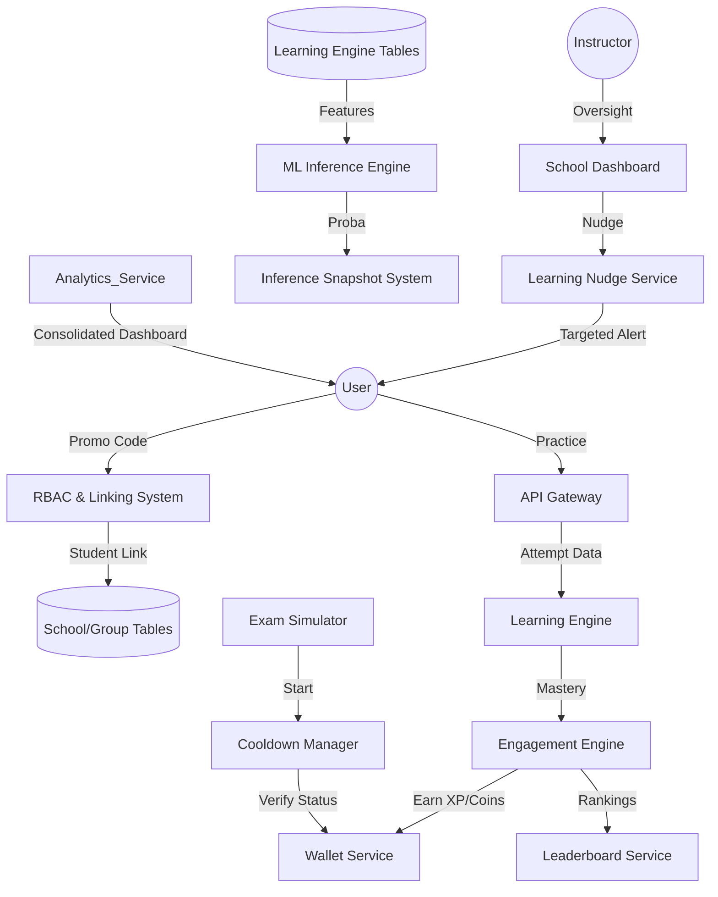

# AUTOTEST Backend Architecture & Interface Contract

This document defines the stable backend architecture of the AUTOTEST platform as of the completion of Phase 2.5 (Intelligence Integration). 

> [!IMPORTANT]
> This architecture is officially **FROZEN**. Future phases (including Phase 3 UI development) must integrate with these interfaces as stable contracts. Do not modify these core schemas or data flows without a comprehensive architectural review.

---

## 1. System Architecture Map

### Major Subsystems
| Subsystem | Responsibility |
|-----------|----------------|
| **Engagement Engine** | Handles XP/Coin accrual and Leaderboard logic. |
| **Cooldown Manager** | Enforces the 2-3 week simulation cooldown; handles XP/Coin-based reductions. |
| **Linking System** | Resolves Promocodes to {Discount, SchoolID, GroupID} and updates User roles. |
| **Nudge Service** | Restricted to School Students; provides instructor-led guidance. |
| **ML Pipeline** | Provides the intelligence foundation for Probabilities and Weak Topics. |

---

## 6. RBAC Subsystem

The Phase 4 hardening layer introduces a dedicated RBAC subsystem for multi-tenant access control.

### Core Tables

- `roles`: Canonical role registry (`SuperAdmin`, `SchoolAdmin`, `Instructor`, `Student`).
- `permissions`: Named permissions such as `admin.users.read` and `school.view_dashboard`.
- `user_roles`: Global or school-scoped role assignments per user.
- `role_permissions`: Mapping table between roles and permissions.
- `school_memberships`: School membership records with optional `group_id` and an attached role.

### Enforcement Model

- Global access is enforced with `require_role("<RoleName>")`.
- School-scoped access is enforced with `require_permission("<permission.name>")`.
- Admin routes resolve through `SuperAdmin` checks while school routes resolve against the effective `school_id`.
- Permission failures return a standardized `403` payload:
  - `error_code`
  - `message`
  - `request_id`

### Scope Resolution

- `school_id` may be supplied explicitly by path/query/header when an endpoint is tenant-scoped.
- If no explicit `school_id` is provided, the backend may infer it when the user has exactly one school-scoped assignment.
- Legacy `users.is_admin` and existing driving-school ownership are preserved as compatibility fallbacks during RBAC resolution.

---

## 7. Promocode & Linking Logic

1.  **Input**: User enters code.
2.  **Validation**: Verify code exists and is not expired.
3.  **Application**:
    - Apply `discount_percent` to subscription if applicable.
    - If `school_id` exists: Create `SchoolStudentLink`.
    - If `group_id` exists: Assign user to the School Group.
4.  **Conversion**: User is now a `School Student` (activates Branding & Nudges).

### 7.1 Promocode Linking System

Phase 4 extends `promo_codes` into a multi-purpose onboarding primitive.

- **Discount**: A promocode may still apply a subscription discount through the existing checkout and redemption flows.
- **School linking**: `POST /api/promocode/apply` reserves the promocode for the authenticated user and creates a `school_memberships` record with the `Student` role when `school_id` is configured.
- **Group assignment**: When `group_id` is present, the same apply flow assigns the membership to that group without overwriting an unrelated school or conflicting group membership.
- **Usage tracking**: `current_uses` is incremented when a code is applied, while payment redemption continues to update `redeemed_count` for purchase completion tracking.

Validation rules enforced by the backend:

- Code must exist.
- Code must be active and within its validity window.
- Code must not exceed `max_uses` / effective usage cap.
- Duplicate user application is blocked.
- Existing school membership cannot be replaced implicitly.

### 7.2 Centralized Logging System

Phase 4 also standardizes backend observability through a centralized JSON logging layer.

- **Request correlation**: `RequestContextMiddleware` assigns a stable `request_id`, stores it on `request.state`, and returns it in the `X-Request-ID` response header.
- **JSON structured logs**: `core/logger.py` emits UTC JSON payloads with `timestamp`, `level`, `service`, `event`, `request_id`, and optional `user_id` plus sanitized `metadata`.
- **Event-based logging**: high-value backend actions emit named events such as `promo_applied`, `rbac_access_denied`, `payment_session_created`, `prediction_generated`, and `unhandled_exception`.
- **Production safety**: log metadata is sanitized to redact sensitive fields such as tokens, passwords, and secrets before serialization.

---

## 8. Exam Simulation Rules

- **Access**: Initially open (requires high-stakes mindset).
- **Cooldown**: 2–3 weeks on failure or completion.
- **Acceleration**: Cooldown reduced by Topic Mastery (Learning Engine) or currency (XP/Coins).
- **Visualization**: Radial timer displayed on the Student Dashboard.
